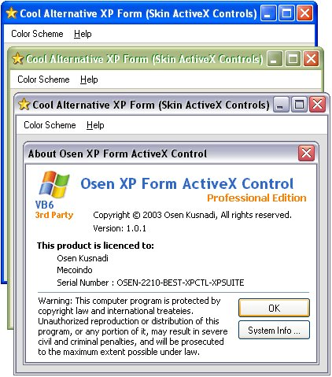



## Exactly Osen XP Form with different Color Scheme \(Blue,Olive Green,Silver\) support menubar

### Description

This is ActiveX Controls, prepared to help to make xp form with different color scheme (blue,olive green,silver) and on this part, it supported for menu bar. look at screen. please download now, and don't forget to vote me !
 
### More Info
 

             |
---                |---
**Submitted On**   |2003-09-05 01:35:12
**By**             |[Osen Kusnadi\.](https://github.com/Planet-Source-Code/PSCIndex/blob/master/ByAuthor/osen-kusnadi.md)
**Level**          |Intermediate
**User Rating**    |4.9 (1131 globes from 233 users)
**Compatibility**  |VB 6\.0
**Category**       |[Custom Controls/ Forms/  Menus](https://github.com/Planet-Source-Code/PSCIndex/blob/master/ByCategory/custom-controls-forms-menus__1-4.md)
**World**          |[Visual Basic](https://github.com/Planet-Source-Code/PSCIndex/blob/master/ByWorld/visual-basic.md)
**Archive File**   |[Exactly\_Os1747405192004\.zip](https://github.com/Planet-Source-Code/osen-kusnadi-exactly-osen-xp-form-with-different-color-scheme-blue-olive-green-silver-supp__1-48185/archive/master.zip)

